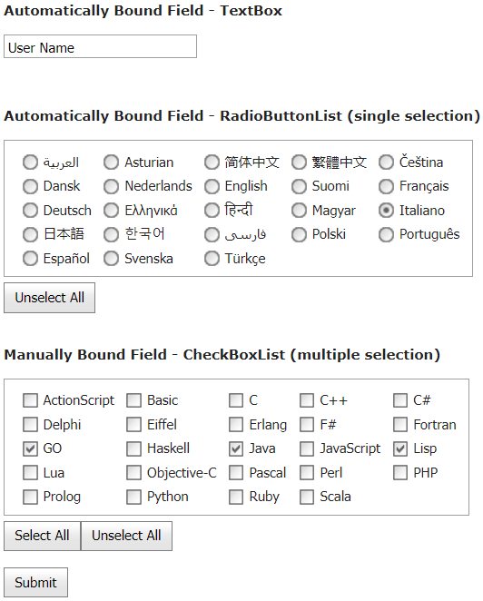

<!-- default badges list -->

[](https://supportcenter.devexpress.com/ticket/details/E4125)
[](https://docs.devexpress.com/GeneralInformation/403183)
<!-- default badges end -->
# Data Editors for ASP.NET MVC - How to use data editors to edit Model fields
<!-- run online -->
**[[Run Online]](https://codecentral.devexpress.com/128549270/)**
<!-- run online end -->

This example demonstrates how to use data editors in bound and unbound modes to edit Model fields.



## Overview

Use the editor's [PreRender](https://docs.devexpress.com/AspNetMvc/DevExpress.Web.Mvc.SettingsBase.PreRender) property to specify multiple selected items based on the enumerable Model field.

```cshtml
settings.PreRender = (sender, e) => {
    ASPxCheckBoxList cbl = (ASPxCheckBoxList)sender;
    foreach(ListEditItem item in cbl.Items) {
        item.Selected = Model.ProgLanguages.Contains((int)item.Value);
    }
};
```

Call the editor's [GetSelectedValues](https://docs.devexpress.com/AspNetMvc/DevExpress.Web.Mvc.CheckBoxListExtension.GetSelectedValues--1(System.String)) method to get multiple selected items on the Controller side. To obtain Model fields from the corresponding editor, use a [DevExpressEditorsBinder](https://docs.devexpress.com/AspNetMvc/DevExpress.Web.Mvc.DevExpressEditorsBinder) object.

```cs
public ActionResult Index([ModelBinder(typeof(DevExpressEditorsBinder))] MyModel model) {
    model.ProgLanguages = CheckBoxListExtension.GetSelectedValues<int>("ProgLanguagesUnbound");
    TempData["PostedModel"] = model;
    return RedirectToAction("Success");
}
```

## Files to Review

* [HomeController.cs](./CS/Controllers/HomeController.cs) (VB: [HomeController.vb](./VB/Controllers/HomeController.vb))
* [Index.cshtml](./CS/Views/Home/Index.cshtml)
